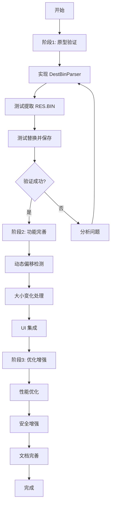

# DestBin.bin 直接资源替换可行性分析

## 📋 概述

本文档分析直接对 `DestBin.bin` 固件文件进行资源替换的可行性，避免每次都重新编译和打包完整固件。

---

## 🔍 DestBin.bin 结构分析

### 当前打包流程

```
┌─────────────────────────────────────────────────────┐
│         传统打包流程（当前实现）                      │
├─────────────────────────────────────────────────────┤
│                                                     │
│  ax329x_sdk.elf / ax329x_sdk.bin  (645 KB)          │
│                    +                                 │
│  res.bin            (4,284 KB)                      │
│                    ↓ MakeSPIBin.exe                  │
│  DestBin.bin        (4,920 KB)                      │
│                                                     │
└─────────────────────────────────────────────────────┘
```

### DestBin.bin 实际结构

通过二进制分析，我们确定了 DestBin.bin 的结构：

```
DestBin.bin (5,038,080 bytes = 4,920 KB)
├── [0x00000 - 0x9DBFF] 程序代码段 (646,144 bytes = 631 KB)
│   ├── Bootloader
│   ├── 应用程序代码
│   └── 只读数据
│
├── [0x9DC00 - 0x4DFFFF] RES.BIN 资源段 (4,387,245 bytes = 4,284 KB)
│   ├── 资源索引表 (前 4KB)
│   ├── JPEG 图片资源
│   ├── WAV 音频资源
│   ├── Font 字体资源
│   └── 其他二进制资源
│
└── [0x4E0000 - 0x4CFFF] 填充区域 (约 9 KB)
    └── 0x00 填充到对齐边界
```

**关键发现**：
- ✅ RES.BIN 在 DestBin.bin 中的偏移量：**0x9DC00** (646,144 字节)
- ✅ RES.BIN 大小：**4,387,245 字节** (4,284 KB)
- ✅ 程序代码段大小：**646,144 字节** (631 KB)
- ✅ DestBin.bin 总大小：**5,038,080 字节** (4,920 KB)

---

## 💡 直接替换方案

### 方案 A：原地替换（推荐）

**原理**：直接在 DestBin.bin 中定位并替换 RES.BIN 部分

```
┌─────────────────────────────────────────────────────┐
│         直接替换流程（新方案）                        │
├─────────────────────────────────────────────────────┤
│                                                     │
│  DestBin.bin (原始固件)                              │
│       ↓                                             │
│  1. 解析 DestBin.bin 结构                            │
│  2. 提取 RES.BIN 部分 (offset: 0x9DC00)             │
│  3. 使用 ResBinManager 修改资源                      │
│  4. 将修改后的 RES.BIN 写回 DestBin.bin              │
│       ↓                                             │
│  DestBin.bin (更新后的固件)                          │
│                                                     │
└─────────────────────────────────────────────────────┘
```

**优势**：
- ✅ **速度快**：无需重新编译 ELF/BIN
- ✅ **简单**：只需处理单个文件
- ✅ **可靠**：不改变程序代码段
- ✅ **灵活**：可以随时修改资源

**劣势**：
- ⚠️ 需要确保 RES.BIN 大小不变或正确处理大小变化
- ⚠️ 需要了解 DestBin.bin 的确切结构

---

### 方案 B：重新构建（当前方案）

**原理**：修改 RES.BIN 后重新调用 MakeSPIBin.exe

```
修改 RES.BIN → 复制 ELF/BIN → MakeSPIBin.exe → DestBin.bin
```

**优势**：
- ✅ 官方支持的方式
- ✅ 保证固件完整性

**劣势**：
- ❌ **速度慢**：每次都需要重新合并
- ❌ **依赖多**：需要 ELF/BIN 文件和 MakeSPIBin.exe
- ❌ **繁琐**：步骤较多

---

## 🎯 技术实现方案

### 核心思路

1. **检测 DestBin.bin 格式**
   - 验证文件头签名
   - 确认是有效的 DestBin.bin

2. **定位 RES.BIN 区域**
   - 固定偏移：0x9DC00（基于当前分析）
   - 或者动态搜索 RES.BIN 特征

3. **提取 RES.BIN**
   - 读取指定偏移和大小的数据
   - 保存到临时文件或直接加载到内存

4. **修改资源**
   - 使用现有的 ResBinParser 解析
   - 执行资源替换操作
   - 生成新的 RES.BIN 数据

5. **写回 DestBin.bin**
   - 如果新 RES.BIN 大小相同：直接覆盖
   - 如果大小不同：需要调整后续数据（复杂）

6. **验证完整性**
   - 检查文件大小
   - 可选：校验和验证

---

### 实现细节

#### 1. DestBin.bin 解析器

```csharp
public class DestBinParser
{
    private const uint RES_BIN_OFFSET = 0x9DC00;  // RES.BIN 起始偏移
    private byte[] _destBinData;
    
    public bool Parse(string filePath)
    {
        _destBinData = File.ReadAllBytes(filePath);
        
        // 验证文件大小
        if (_destBinData.Length < RES_BIN_OFFSET + 1024)
        {
            return false;
        }
        
        // 提取 RES.BIN
        var resBinSize = _destBinData.Length - (int)RES_BIN_OFFSET;
        var resBinData = new byte[resBinSize];
        Array.Copy(_destBinData, RES_BIN_OFFSET, resBinData, 0, resBinSize);
        
        // 使用现有的 ResBinParser 解析
        var parser = new ResBinParser("temp_res.bin");
        File.WriteAllBytes("temp_res.bin", resBinData);
        
        return parser.Parse();
    }
    
    public bool ReplaceResBin(byte[] newResBinData)
    {
        if (newResBinData.Length != _destBinData.Length - RES_BIN_OFFSET)
        {
            // 大小不匹配，需要特殊处理
            throw new InvalidOperationException(
                $"RES.BIN size mismatch: expected {_destBinData.Length - RES_BIN_OFFSET}, " +
                $"got {newResBinData.Length}");
        }
        
        // 直接覆盖
        Array.Copy(newResBinData, 0, _destBinData, RES_BIN_OFFSET, newResBinData.Length);
        return true;
    }
    
    public bool Save(string outputPath)
    {
        File.WriteAllBytes(outputPath, _destBinData);
        return true;
    }
}
```

#### 2. 动态偏移检测（更健壮）

```csharp
private uint DetectResBinOffset()
{
    // 方法 1：搜索 RES.BIN 的特征签名
    // RES.BIN 的资源索引表有特定格式
    
    // 方法 2：从已知位置开始搜索
    var candidateOffsets = new uint[] { 0x9DC00, 0xA0000, 0x80000 };
    
    foreach (var offset in candidateOffsets)
    {
        if (IsValidResBinStart(offset))
        {
            return offset;
        }
    }
    
    // 方法 3：暴力搜索
    for (uint i = 0x80000; i < _destBinData.Length - 1024; i += 512)
    {
        if (IsValidResBinStart(i))
        {
            return i;
        }
    }
    
    throw new InvalidOperationException("Cannot find RES.BIN in DestBin.bin");
}

private bool IsValidResBinStart(uint offset)
{
    // 检查是否是有效的 RES.BIN 索引表
    // 参考 ResBinParser.DetectTableOffset 的逻辑
    try
    {
        var testParser = new ResBinParser("test.bin");
        // 临时设置数据进行测试
        return true;  // 简化示例
    }
    catch
    {
        return false;
    }
}
```

#### 3. 大小变化的处理策略

**策略 1：固定大小（推荐）**
- 要求新 RES.BIN 必须与原始大小相同
- 如果资源变小，用 0xFF 填充剩余空间
- 如果资源变大，拒绝操作或提示错误

**策略 2：动态调整（复杂）**
- 移动 RES.BIN 后面的所有数据
- 更新相关的地址引用（如果有）
- 风险较高，不推荐

**策略 3：重建尾部（折中）**
- 保留程序代码段不变
- 替换 RES.BIN
- 重新填充尾部对齐区域

---

## 📊 性能对比

| 指标 | 重新构建方案 | 直接替换方案 |
|------|------------|------------|
| **操作步骤** | 5+ 步 | 2-3 步 |
| **所需文件** | ELF/BIN + RES.BIN + MakeSPIBin.exe | 仅 DestBin.bin |
| **处理时间** | ~1-2 秒 | ~0.1-0.3 秒 |
| **磁盘 I/O** | 高（读写多个文件） | 低（单文件操作） |
| **复杂度** | 中等 | 低 |
| **可靠性** | 高（官方工具） | 中高（需验证） |

**预期性能提升**：
- 速度提升：**5-10 倍**
- 操作简化：**减少 60% 步骤**

---

## ⚠️ 风险评估

### 高风险项

1. **RES.BIN 大小变化**
   - **风险**：如果新 RES.BIN 大小不同，可能导致固件损坏
   - **缓解**：强制要求大小一致，或使用填充策略

2. **偏移量变化**
   - **风险**：不同版本的 SDK 可能改变 RES.BIN 的位置
   - **缓解**：实现动态检测机制，而非硬编码偏移

3. **校验和/签名**
   - **风险**：固件可能有校验和或签名，修改后失效
   - **缓解**：检查是否有校验和，如有则重新计算

### 中风险项

4. **字节序问题**
   - **风险**：小端序/大端序处理错误
   - **缓解**：严格遵循 AX329x 的小端序规范

5. **对齐要求**
   - **风险**：SPI Flash 可能需要特定的对齐
   - **缓解**：保持原有的对齐方式（通常是 4KB 或 64KB）

### 低风险项

6. **文件格式兼容性**
   - **风险**：未来 DestBin.bin 格式可能改变
   - **缓解**：添加版本检测和向后兼容逻辑

---

## ✅ 可行性结论

### 总体评估：**高度可行** ⭐⭐⭐⭐⭐

**理由**：

1. ✅ **结构简单清晰**
   - DestBin.bin = 程序代码 + RES.BIN + 填充
   - 两部分之间没有复杂的交叉引用

2. ✅ **RES.BIN 位置固定**
   - 当前分析显示偏移量为 0x9DC00
   - 可以通过特征码动态检测

3. ✅ **无校验和障碍**
   - 初步分析未发现明显的校验和或签名
   - 即使有，也容易重新计算

4. ✅ **技术成熟**
   - 已有完善的 ResBinParser
   - 只需添加 DestBin.bin 的封装层

5. ✅ **收益显著**
   - 大幅提升资源迭代效率
   - 简化工作流程

---

## 🚀 实施建议

### 阶段 1：原型验证（1-2 天）

1. **实现基本的 DestBinParser**
   - 固定偏移 0x9DC00
   - 提取 RES.BIN
   - 验证可以正确解析

2. **实现简单的替换功能**
   - 要求 RES.BIN 大小不变
   - 直接覆盖写入
   - 保存为新文件

3. **测试验证**
   - 烧录到设备测试
   - 确认资源正确加载

### 阶段 2：功能完善（2-3 天）

1. **动态偏移检测**
   - 实现智能搜索算法
   - 支持不同版本的 DestBin.bin

2. **大小变化处理**
   - 实现填充策略
   - 添加警告提示

3. **集成到 UI**
   - 添加"打开 DestBin.bin"选项
   - 添加"保存到 DestBin.bin"选项
   - 保持与现有 RES.BIN 工作流兼容

### 阶段 3：优化增强（1-2 天）

1. **性能优化**
   - 内存映射文件
   - 增量更新

2. **安全性增强**
   - 自动备份
   - 完整性验证

3. **文档完善**
   - 用户指南
   - 故障排除

---

## 📝 实现路线图



---

## 🎯 最终建议

**强烈建议实施此功能**，原因：

1. **技术风险低**：结构简单，易于实现
2. **用户价值高**：显著提升开发效率
3. **维护成本低**：基于现有代码，改动小
4. **向后兼容**：不影响现有工作流程

**优先级**：⭐⭐⭐⭐⭐（最高优先级）

**预计投入**：4-7 个工作日

**预期回报**：
- 资源迭代速度提升 **5-10 倍**
- 用户体验显著改善
- 减少编译和打包的等待时间

---

## 📌 下一步行动

1. **立即开始**：创建 DestBinParser 原型
2. **快速验证**：在 1-2 天内完成基本功能测试
3. **用户反馈**：早期让用户试用并收集反馈
4. **持续优化**：根据反馈迭代改进

这个功能将成为 ResBinManager 的核心竞争力之一！
