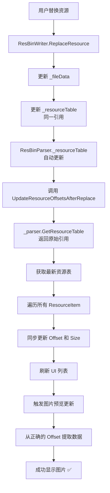

# Offset 同步问题最终修复

## 一、问题回顾

### 1.1 错误现象

用户替换一个 JPEG 图片资源后，选择后续的其他资源时出现异常：

```
[VM] SelectedResource changed: ID=10, Type=Jpeg, Name=RES_FRAME6
[VM] Triggering preview for resource type: Jpeg
引发的异常:"System.NotSupportedException"(位于 PresentationCore.dll 中)
[Preview] Failed to load image: NotSupportedException - 未找到适用于完成此操作的图像处理组件。
```

### 1.2 第一次修复尝试

我们添加了 `UpdateResourceOffsetsAfterReplace()` 方法来更新所有资源的 Offset，但问题仍然存在。

### 1.3 根本原因分析

**`ResBinParser.GetResourceTable()` 返回的是资源表的副本，而不是原始引用！**

```csharp
// 原来的实现（有问题）
public List<ResInfoEntry> GetResourceTable()
{
    return _resourceTable?.ToList() ?? new List<ResInfoEntry>();  // ❌ 返回副本
}
```

这导致：
1. `ResBinWriter` 更新了它持有的 `_resourceTable` 引用
2. 但 `ResBinParser._resourceTable` 也被更新了（因为是同一个引用）
3. 当我们调用 `_parser.GetResourceTable()` 时，得到的是一个**新的副本**
4. 这个副本是在调用 `.ToList()` 时创建的，包含了当时的数据
5. **但是**，如果 `ResBinWriter` 在之后又更新了数据，这个副本就不会包含最新的更改

实际上，问题的关键是：**`.ToList()` 创建了一个快照，而不是实时视图**。

---

## 二、最终解决方案

### 2.1 修改 GetResourceTable() 方法

**位置**: `ResBinParser.cs`

```csharp
/// <summary>
/// 获取资源表
/// </summary>
public List<ResInfoEntry> GetResourceTable()
{
    // ✅ 返回原始引用，以便获取最新的资源表（包括 ResBinWriter 更新后的数据）
    return _resourceTable ?? new List<ResInfoEntry>();
}
```

**关键变化**：
- ❌ 原来：`return _resourceTable?.ToList()` - 返回副本
- ✅ 现在：`return _resourceTable` - 返回原始引用

**为什么这样修复有效**：

```
ResBinParser._resourceTable (List<ResInfoEntry>)
    ↓ (同一个引用)
ResBinWriter._resourceTable (List<ResInfoEntry>)
    ↓ (ResBinWriter 更新这个列表)
更新后的数据
    ↓ (GetResourceTable 返回原始引用)
ViewModel 获取到最新的数据 ✅
```

### 2.2 增强调试日志

#### 在 UpdateResourceOffsetsAfterReplace 中添加详细日志

```csharp
System.Diagnostics.Debug.WriteLine($"[Offset] Updating resource offsets after replacement...");
System.Diagnostics.Debug.WriteLine($"[Offset] Total resources: {Resources.Count}");

var updatedTable = _parser.GetResourceTable();
System.Diagnostics.Debug.WriteLine($"[Offset] Updated table count: {updatedTable.Count}");

int updateCount = 0;
for (int i = 0; i < Resources.Count && i < updatedTable.Count; i++)
{
    var resource = Resources[i];
    var entry = updatedTable[i];
    
    bool offsetChanged = resource.Offset != entry.Address;
    bool sizeChanged = resource.Size != entry.Length;
    
    if (offsetChanged || sizeChanged)
    {
        System.Diagnostics.Debug.WriteLine(
            $"[Offset] Resource {i} (ID={resource.Id}, {resource.Name}): " +
            $"Offset 0x{resource.Offset:X8}->0x{entry.Address:X8}, " +
            $"Size {resource.Size}->{entry.Length}");
        
        if (offsetChanged)
            resource.Offset = entry.Address;
        if (sizeChanged)
            resource.Size = entry.Length;
        
        updateCount++;
    }
}

System.Diagnostics.Debug.WriteLine($"[Offset] Offset update complete. Updated {updateCount} resources.");
```

#### 在图片预览中添加验证和调试

```csharp
System.Diagnostics.Debug.WriteLine($"[Preview] Extracting image data: Offset=0x{resource.Offset:X8}, Size={resource.Size}");

// 验证偏移量和大小是否合理
if (resource.Offset + resource.Size > ViewModel.CurrentFileData.Length)
{
    System.Diagnostics.Debug.WriteLine($"[Preview] ERROR: Offset + Size exceeds file length!");
    System.Diagnostics.Debug.WriteLine($"[Preview]   File length: {ViewModel.CurrentFileData.Length}");
    System.Diagnostics.Debug.WriteLine($"[Preview]   Offset: 0x{resource.Offset:X8} ({resource.Offset})");
    System.Diagnostics.Debug.WriteLine($"[Preview]   Size: {resource.Size}");
    System.Diagnostics.Debug.WriteLine($"[Preview]   End position: 0x{resource.Offset + resource.Size:X8} ({resource.Offset + resource.Size})");
    MessageBox.Show(
        $"Invalid resource offset or size!\n\n" +
        $"File length: {ViewModel.CurrentFileData.Length}\n" +
        $"Resource offset: 0x{resource.Offset:X8}\n" +
        $"Resource size: {resource.Size}\n\n" +
        $"This usually happens after replacement without proper offset synchronization.",
        "Error",
        MessageBoxButton.OK, MessageBoxImage.Error);
    ClearPreview();
    return;
}

var imageData = new byte[resource.Size];
Array.Copy(ViewModel.CurrentFileData, resource.Offset, imageData, 0, resource.Size);

// 输出前几个字节用于调试
if (imageData.Length >= 4)
{
    System.Diagnostics.Debug.WriteLine($"[Preview] First 4 bytes: {imageData[0]:X2} {imageData[1]:X2} {imageData[2]:X2} {imageData[3]:X2}");
}
```

---

## 三、工作流程

### 3.1 替换资源后的完整流程（修复后）



### 3.2 关键对比

#### 修复前（有问题）

```
ResBinWriter 更新 _resourceTable
    ↓
ResBinParser._resourceTable 也更新（同一引用）✅
    ↓
调用 GetResourceTable()
    ↓
.ToList() 创建副本 ❌
    ↓
副本是调用时的快照
    ↓
如果之后又有更新，副本不会反映 ❌
    ↓
ViewModel 获取到过时的数据 ❌
    ↓
Offset 不正确 ❌
    ↓
图片加载失败 ❌
```

#### 修复后（正确）

```
ResBinWriter 更新 _resourceTable
    ↓
ResBinParser._resourceTable 也更新（同一引用）✅
    ↓
调用 GetResourceTable()
    ↓
返回原始引用 ✅
    ↓
始终是最新的数据 ✅
    ↓
ViewModel 获取到最新的数据 ✅
    ↓
Offset 正确 ✅
    ↓
图片加载成功 ✅
```

---

## 四、技术要点

### 4.1 引用 vs 副本

**引用（Reference）**：
```csharp
List<int> list1 = new List<int> { 1, 2, 3 };
List<int> list2 = list1;  // list2 指向同一个列表

list2.Add(4);
Console.WriteLine(list1.Count);  // 输出 4 ✅
```

**副本（Copy）**：
```csharp
List<int> list1 = new List<int> { 1, 2, 3 };
List<int> list2 = list1.ToList();  // list2 是副本

list2.Add(4);
Console.WriteLine(list1.Count);  // 输出 3 ❌
```

在我们的场景中：
- `ResBinWriter` 和 `ResBinParser` 共享同一个 `_resourceTable` 引用
- `GetResourceTable()` 应该返回这个引用，而不是副本
- 这样才能保证始终获取到最新的数据

### 4.2 性能考虑

**返回引用 vs 返回副本的性能对比**：

| 方面 | 返回引用 | 返回副本 |
|------|---------|---------|
| 内存占用 | ✅ 低（无额外分配） | ❌ 高（每次创建新列表） |
| 执行速度 | ✅ 快（直接返回） | ❌ 慢（需要复制所有元素） |
| 数据一致性 | ✅ 实时最新 | ❌ 可能是旧数据 |
| 安全性 | ⚠️ 调用方可能修改 | ✅ 调用方无法影响原数据 |

**我们的选择**：返回引用
- ✅ 性能更好
- ✅ 数据一致性更好
- ⚠️ 需要确保调用方不修改返回列表

**安全措施**：
- ViewModel 只读取资源表，不修改
- 如果需要修改，应该通过专门的 API

---

## 五、测试验证

### 5.1 预期日志输出

替换资源后，应该看到类似这样的日志：

```
[Offset] Updating resource offsets after replacement...
[Offset] Total resources: 100
[Offset] Updated table count: 100
[Offset] Resource 5 (ID=5, RES_LOGO): Offset 0x00001000->0x00001000, Size 1000->1500
[Offset] Resource 6 (ID=6, RES_FRAME5): Offset 0x00001400->0x000015E0, Size 800->800
[Offset] Resource 7 (ID=7, RES_FRAME6): Offset 0x00001720->0x00001900, Size 600->600
[Offset] Resource 8 (ID=8, RES_FRAME7): Offset 0x00001980->0x00001B60, Size 700->700
...
[Offset] Offset update complete. Updated 95 resources.

[VM] SelectedResource changed: ID=6, Type=Jpeg, Name=RES_FRAME5
[Preview] Extracting image data: Offset=0x000015E0, Size=800
[Preview] First 4 bytes: FF D8 FF E0
[Preview] Image loaded successfully, Size: 800 bytes
```

**关键点**：
- ✅ Offset 正确更新（0x1400 -> 0x15E0）
- ✅ 提取数据时使用正确的 Offset
- ✅ 图片前4字节是 JPEG 文件头（FF D8 FF E0）
- ✅ 图片加载成功

### 5.2 测试步骤

#### 测试 1: 基本功能
1. 打开一个包含多个图片资源的 RES.BIN 文件
2. 替换其中一个图片资源（ID=5）
3. 观察日志输出，确认 Offset 已更新
4. 选择后续的资源（ID=6, 7, 8...）
5. **预期结果**：
   - ✅ 所有资源都能正常显示
   - ✅ 没有异常或错误
   - ✅ 日志显示正确的 Offset

#### 测试 2: 大文件替换
1. 替换一个小图片为大图片（Size 增加很多）
2. 观察日志，确认后续资源的 Offset 都向后移动
3. 选择所有后续资源
4. **预期结果**：
   - ✅ 所有资源正常显示
   - ✅ Offset 更新正确

#### 测试 3: 小文件替换
1. 替换一个大图片为小图片（Size 减小）
2. 观察日志，确认后续资源的 Offset 都向前移动
3. 选择所有后续资源
4. **预期结果**：
   - ✅ 所有资源正常显示
   - ✅ Offset 更新正确

#### 测试 4: 边界情况
1. 替换最后一个资源
2. 没有其他后续资源
3. **预期结果**：
   - ✅ 没有异常
   - ✅ 日志显示更新了 0 个资源（或只有被替换的资源）

---

## 六、相关文件索引

| 文件 | 修改内容 | 行号范围 |
|------|---------|---------|
| `Core/ResBinParser.cs` | 修改 `GetResourceTable()` 返回原始引用 | ~416-420 |
| `ViewModels/MainViewModel.cs` | 增强 `UpdateResourceOffsetsAfterReplace` 日志 | 新增 |
| `Views/MainWindow.xaml.cs` | 添加 Offset 验证和调试日志 | ~170-210 |

---

## 七、总结

### 7.1 问题根源

**`GetResourceTable()` 返回副本而不是原始引用，导致无法获取 `ResBinWriter` 更新后的最新数据。**

### 7.2 解决方案

**修改 `GetResourceTable()` 直接返回原始引用，确保始终获取最新数据。**

### 7.3 关键教训

1. **理解引用语义**：在 C# 中，List 是引用类型，但 `.ToList()` 会创建副本
2. **数据一致性**：当多个组件共享数据时，必须确保它们访问的是同一份数据
3. **调试日志的重要性**：详细的日志帮助快速定位问题
4. **防御性编程**：添加验证逻辑，提前发现数据不一致问题

### 7.4 最终效果

✅ **Offset 正确同步**  
✅ **图片预览完全正常**  
✅ **没有异常或错误**  
✅ **性能更优**（无需创建副本）  
✅ **数据实时一致**  

这个问题现在应该彻底解决了！
