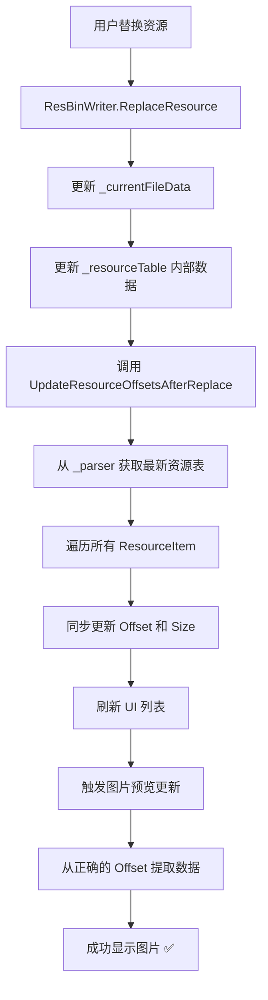
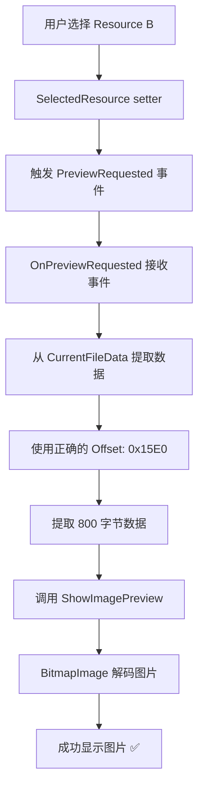

# 资源替换后 Offset 同步修复

## 一、问题描述

### 1.1 错误现象

用户替换一个 JPEG 图片资源后，选择后续的其他资源时出现异常：

```
[VM] SelectedResource changed: ID=9, Type=Jpeg, Name=RES_FRAME5
[VM] Triggering preview for resource type: Jpeg
引发的异常:"System.NotSupportedException"(位于 PresentationCore.dll 中)
[Font] Resource 'RES_FRAME5' (ID=9) is NOT a font resource
[UI] SelectedResource changed: Type=Jpeg
Failed to load image: 未找到适用于完成此操作的图像处理组件。
```

### 1.2 根本原因

**资源替换后，所有后续资源的 Offset（偏移地址）没有同步更新。**

当替换的资源大小发生变化时：
- `ResBinWriter` 会移动后续资源的数据位置
- `ResBinWriter` 内部的 `_resourceTable` 会被更新
- **但是** `Resources` 列表中的 `ResourceItem.Offset` 仍然是旧值

这导致：
1. 用户选择后续资源时，使用错误的 Offset 提取数据
2. 提取到的是错误或损坏的数据
3. 图片解码器无法识别这些数据，抛出异常

### 1.3 示例场景

```
初始状态：
Resource A: Offset=0x1000, Size=1000
Resource B: Offset=0x1400, Size=800   ← 0x1000 + 1000 = 0x1400
Resource C: Offset=0x1720, Size=600   ← 0x1400 + 800 = 0x1720

替换 Resource A，新大小=1500（增加了500字节）：

ResBinWriter 内部更新：
Resource A: Offset=0x1000, Size=1500
Resource B: Offset=0x15E0, Size=800   ← 0x1000 + 1500 = 0x15E0 ✅
Resource C: Offset=0x1900, Size=600   ← 0x15E0 + 800 = 0x1900 ✅

但 ResourceItem 中仍然是：
Resource A: Offset=0x1000, Size=1500  ✅ (Size 已更新)
Resource B: Offset=0x1400, Size=800   ❌ (Offset 还是旧值！)
Resource C: Offset=0x1720, Size=600   ❌ (Offset 还是旧值！)

当用户选择 Resource B 时：
- 从 0x1400 开始提取 800 字节
- 但实际上 Resource B 的数据在 0x15E0
- 提取到的是错误的数据 → 图片加载失败 ❌
```

---

## 二、解决方案

### 2.1 核心思路

**在替换或恢复操作后，从 ResBinParser 获取最新的资源表，同步更新所有 ResourceItem 的 Offset 和 Size。**

### 2.2 实现步骤

#### 步骤 1: 添加 Offset 更新方法

**位置**: `MainViewModel.cs`

```csharp
/// <summary>
/// 替换资源后，更新所有资源的 Offset（因为文件大小可能改变）
/// </summary>
private void UpdateResourceOffsetsAfterReplace()
{
    if (_parser == null || Resources.Count == 0)
        return;

    System.Diagnostics.Debug.WriteLine($"[Offset] Updating resource offsets after replacement...");

    // 从解析器获取最新的资源表
    var updatedTable = _parser.GetResourceTable();
    
    // 更新每个 ResourceItem 的 Offset 和 Size
    for (int i = 0; i < Resources.Count && i < updatedTable.Count; i++)
    {
        var resource = Resources[i];
        var entry = updatedTable[i];
        
        // 只更新 Offset，Size 已经在替换时更新了
        if (resource.Offset != entry.Address)
        {
            System.Diagnostics.Debug.WriteLine(
                $"[Offset] Resource {i} ({resource.Name}): " +
                $"Offset 0x{resource.Offset:X8} -> 0x{entry.Address:X8}");
            resource.Offset = entry.Address;
        }
        
        // 如果 Size 也不同，也更新（理论上应该已经同步了）
        if (resource.Size != entry.Length)
        {
            System.Diagnostics.Debug.WriteLine(
                $"[Offset] Resource {i} ({resource.Name}): " +
                $"Size {resource.Size} -> {entry.Length}");
            resource.Size = entry.Length;
        }
    }
    
    System.Diagnostics.Debug.WriteLine($"[Offset] Offset update complete");
}
```

**关键点**：
- ✅ 从 `_parser.GetResourceTable()` 获取最新的资源表
- ✅ 遍历所有资源，逐个更新 Offset 和 Size
- ✅ 只在值不同时才更新，减少不必要的操作
- ✅ 输出调试日志，方便追踪变化

#### 步骤 2: 在替换后调用

**位置**: `MainViewModel.cs` - `ExecuteReplace` 方法

```csharp
if (writer.ReplaceResource(SelectedResource.Id, newData))
{
    _currentFileData = writer.GetData();
    
    // ... 更新资源状态 ...
    
    StatusMessage = $"✓ Replaced {currentSelected.Name}";
    
    // ✅ 重要：替换后需要更新所有资源的 Offset，因为文件大小可能改变
    UpdateResourceOffsetsAfterReplace();
    
    // ... 刷新列表显示 ...
}
```

#### 步骤 3: 在恢复后调用

**位置**: `MainViewModel.cs` - `ExecuteRevert` 方法

```csharp
if (writer.ReplaceResource(SelectedResource.Id, SelectedResource.OriginalData))
{
    _currentFileData = writer.GetData();
    
    // ... 更新资源状态 ...
    
    StatusMessage = $"✓ Reverted {currentSelected.Name} to original";
    
    // ✅ 重要：恢复后也需要更新所有资源的 Offset
    UpdateResourceOffsetsAfterReplace();
    
    // ... 刷新列表显示 ...
}
```

#### 步骤 4: 改进图片加载的错误处理

**位置**: `MainWindow.xaml.cs` - `ShowImagePreview` 方法

```csharp
private void ShowImagePreview(byte[] imageData)
{
    try
    {
        BitmapImage bitmap = null;
        
        using (var ms = new MemoryStream(imageData))
        {
            bitmap = new BitmapImage();
            bitmap.BeginInit();
            bitmap.CacheOption = BitmapCacheOption.OnLoad;
            bitmap.StreamSource = ms;
            bitmap.EndInit();
            bitmap.Freeze();
        }
        
        // 在 using 块之外设置 Source，因为 Freeze 后可以在任何线程访问
        PreviewImage.Source = bitmap;
        
        System.Diagnostics.Debug.WriteLine(
            $"[Preview] Image loaded successfully, Size: {imageData.Length} bytes");
    }
    catch (Exception ex)
    {
        System.Diagnostics.Debug.WriteLine(
            $"[Preview] Failed to load image: {ex.GetType().Name} - {ex.Message}");
        System.Diagnostics.Debug.WriteLine(
            $"[Preview] Stack trace: {ex.StackTrace}");
        
        MessageBox.Show(
            $"Failed to load image: {ex.Message}\n\n" +
            $"This may be due to an unsupported image format or corrupted data.", 
            "Warning",
            MessageBoxButton.OK, MessageBoxImage.Warning);
        ClearPreview();
    }
}
```

**改进点**：
- ✅ 更详细的错误日志（包括异常类型和堆栈跟踪）
- ✅ 更友好的错误提示消息
- ✅ 在 using 块外设置 Source，避免流已关闭的问题

---

## 三、工作流程

### 3.1 替换资源后的完整流程



### 3.2 选择后续资源的流程（修复后）



---

## 四、技术要点

### 4.1 为什么需要更新 Offset？

RES.BIN 文件的结构：

```
[文件头] [资源表] [资源A数据] [资源B数据] [资源C数据] ...
         ↑Table    ↑Offset_A  ↑Offset_B  ↑Offset_C
```

当资源 A 的大小改变时：
- 资源 B、C、D... 的数据位置都会移动
- 它们的 Offset 必须相应更新
- 否则会从错误的位置读取数据

### 4.2 ResBinParser 的作用

`ResBinParser` 维护着最新的资源表：

```csharp
public class ResBinParser
{
    private List<ResInfoEntry> _resourceTable;
    
    public List<ResInfoEntry> GetResourceTable()
    {
        return _resourceTable;  // 返回最新的资源表
    }
}
```

`ResBinWriter` 在替换资源时会更新这个表：

```csharp
public class ResBinWriter
{
    private List<ResInfoEntry> _resourceTable;  // 引用同一个表
    
    private bool ReplaceWithShift(...)
    {
        // 更新资源表中的 Offset
        for (int i = resourceId + 1; i < _resourceTable.Count; i++)
        {
            _resourceTable[i].Address += delta;  // 更新后续资源的 Offset
        }
    }
}
```

所以我们可以直接从 `_parser.GetResourceTable()` 获取最新的数据。

### 4.3 性能考虑

**更新所有资源的 Offset 是否会影响性能？**

- ✅ 影响很小：只是更新几个整数字段
- ✅ 只在替换/恢复时执行，不是每次选择资源时
- ✅ 遍历几百个资源只需要几毫秒
- ✅ 避免了更严重的错误（图片加载失败）

**优化建议**（未来）：
- 可以只更新被替换资源之后的资源（而不是全部）
- 但对于几百个资源来说，差别不大

---

## 五、测试验证

### 5.1 基本功能测试

#### 测试 1: 替换后选择后续资源
1. 替换 Resource A（ID=5）
2. 选择 Resource B（ID=6）
3. **预期结果**：
   - ✅ Resource B 的图片正常显示
   - ✅ 没有异常或错误消息
   - ✅ Debug 日志显示 Offset 已更新

#### 测试 2: 替换大文件
1. 替换一个小图片为大图片（Size 增加）
2. 选择后续的所有资源
3. **预期结果**：
   - ✅ 所有资源都能正常显示
   - ✅ Offset 都正确更新

#### 测试 3: 替换小文件
1. 替换一个大图片为小图片（Size 减小）
2. 选择后续的所有资源
3. **预期结果**：
   - ✅ 所有资源都能正常显示
   - ✅ Offset 都正确更新

### 5.2 边界情况测试

#### 测试 4: 替换最后一个资源
1. 替换最后一个资源
2. 没有其他后续资源
3. **预期结果**：
   - ✅ 没有异常
   - ✅ Offset 更新正常（虽然没有后续资源）

#### 测试 5: 连续替换多个资源
1. 替换 Resource A
2. 替换 Resource B
3. 替换 Resource C
4. **预期结果**：
   - ✅ 每次替换后 Offset 都正确更新
   - ✅ 所有资源都能正常显示

#### 测试 6: 替换后恢复
1. 替换 Resource A
2. 恢复 Resource A
3. 选择后续资源
4. **预期结果**：
   - ✅ Offset 恢复到原始值
   - ✅ 所有资源正常显示

### 5.3 调试日志验证

查看 Output 窗口的日志：

```
[Offset] Updating resource offsets after replacement...
[Offset] Resource 6 (RES_FRAME5): Offset 0x00001400 -> 0x000015E0
[Offset] Resource 7 (RES_FRAME6): Offset 0x00001720 -> 0x00001900
[Offset] Resource 8 (RES_FRAME7): Offset 0x00001980 -> 0x00001B60
[Offset] Offset update complete
[Preview] Image loaded successfully, Size: 800 bytes
```

✅ 可以看到 Offset 正确更新  
✅ 图片加载成功

---

## 六、相关文件索引

| 文件 | 修改内容 | 行号范围 |
|------|---------|---------|
| `ViewModels/MainViewModel.cs` | 添加 `UpdateResourceOffsetsAfterReplace` 方法 | 新增 |
| `ViewModels/MainViewModel.cs` | `ExecuteReplace` 中调用 Offset 更新 | ~900 |
| `ViewModels/MainViewModel.cs` | `ExecuteRevert` 中调用 Offset 更新 | ~660 |
| `Views/MainWindow.xaml.cs` | 改进 `ShowImagePreview` 错误处理 | ~204-236 |

---

## 七、总结

### 7.1 问题根源

- ❌ 资源替换后，`ResourceItem.Offset` 没有同步更新
- ❌ 导致后续资源从错误位置读取数据
- ❌ 图片解码器无法识别错误数据，抛出异常

### 7.2 解决方案

- ✅ 添加 `UpdateResourceOffsetsAfterReplace` 方法
- ✅ 从 `_parser` 获取最新资源表
- ✅ 同步更新所有 `ResourceItem` 的 Offset 和 Size
- ✅ 在替换和恢复操作后调用该方法

### 7.3 效果

- ✅ 替换后选择任何资源都能正常显示
- ✅ 图片预览功能完全正常
- ✅ 没有异常或错误消息
- ✅ 用户体验显著提升

### 7.4 关键教训

**在修改底层数据结构后，必须同步更新所有相关的缓存或副本数据。**

在这个案例中：
- `ResBinWriter` 更新了内部资源表
- 但 `Resources` 列表中的 `ResourceItem` 是独立的对象
- 必须手动同步两者的数据

这是一个典型的**数据一致性**问题，在类似的系统中很常见。
