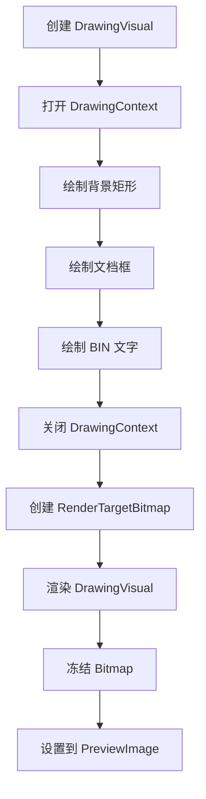
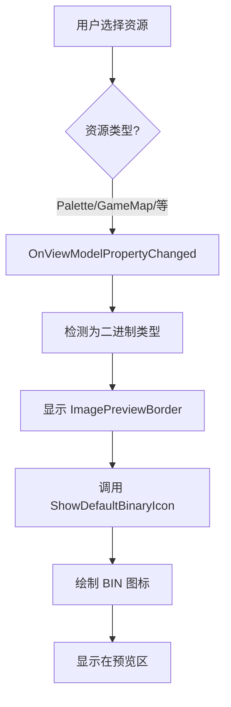

# 二进制资源默认图标显示功能

## 一、功能概述

当用户选择 Palette、GameMap、EncodingTable、IconSelection 或 OsdSource 等二进制资源类型时，在预览面板的 ImagePreviewBorder 中显示一个默认的"BIN"文件图标，而不是空白区域。

---

## 二、实现方案

### 2.1 技术方案

使用 WPF 的 **DrawingVisual** 和 **RenderTargetBitmap** 动态绘制一个简单的图标，而不是加载外部图片文件。

**优点**：
- ✅ 无需外部图片文件
- ✅ 图标始终可用
- ✅ 可以自定义颜色和样式
- ✅ 矢量绘制，清晰度高

### 2.2 图标设计

**视觉效果**：
```
┌─────────────────┐
│  浅灰色背景      │
│                 │
│   ┌─────────┐   │
│   │         │   │
│   │   BIN   │   │  ← 蓝色文字，居中
│   │         │   │
│   └─────────┘   │
│    白色文档框    │
│                 │
└─────────────────┘
```

**颜色方案**：
- 背景：浅灰色 (RGB: 240, 240, 240)
- 文档框：白色，灰色边框 (RGB: 100, 100, 100)
- 文字：蓝色 (RGB: 0, 120, 215) - Azure 蓝色
- 文字内容："BIN"
- 字体：Arial, 24pt

---

## 三、代码实现

### 3.1 添加必要的命名空间

**位置**: `MainWindow.xaml.cs` 文件顶部

```csharp
using System.Windows.Media;
using System.Windows.Shapes;
```

### 3.2 修改资源类型处理逻辑

**位置**: `OnViewModelPropertyChanged` 方法中的二进制资源处理部分

```csharp
else if (resourceType == Models.ResourceType.Palette || 
         resourceType == Models.ResourceType.GameMap || 
         resourceType == Models.ResourceType.EncodingTable ||
         resourceType == Models.ResourceType.IconSelection ||
         resourceType == Models.ResourceType.OsdSource)
{
    System.Diagnostics.Debug.WriteLine($"[UI] Showing Binary preview for {resourceType}");
    WavControlPanel.Visibility = Visibility.Collapsed;
    FontControlPanel.Visibility = Visibility.Collapsed;
    ImagePreviewBorder.Visibility = Visibility.Visible;
    ActionButtonsPanel.Visibility = Visibility.Visible;
    
    // 显示默认的二进制文件图标
    ShowDefaultBinaryIcon();
}
```

### 3.3 实现 ShowDefaultBinaryIcon 方法

**位置**: `MainWindow.xaml.cs` - 在 `ClearPreview` 方法之后

```csharp
/// <summary>
/// 显示默认的二进制文件图标
/// </summary>
private void ShowDefaultBinaryIcon()
{
    try
    {
        // 创建一个简单的蓝色文档图标
        var drawingVisual = new DrawingVisual();
        using (var drawingContext = drawingVisual.RenderOpen())
        {
            // 背景 - 浅灰色
            var backgroundBrush = new SolidColorBrush(Color.FromRgb(240, 240, 240));
            drawingContext.DrawRectangle(backgroundBrush, null, new Rect(0, 0, 100, 100));
            
            // 文档形状 - 白色
            var docBrush = new SolidColorBrush(Colors.White);
            var docPen = new Pen(new SolidColorBrush(Color.FromRgb(100, 100, 100)), 2);
            drawingContext.DrawRectangle(docBrush, docPen, new Rect(20, 15, 60, 70));
            
            // "BIN" 文字
            var textBrush = new SolidColorBrush(Color.FromRgb(0, 120, 215));
            var formattedText = new FormattedText(
                "BIN",
                System.Globalization.CultureInfo.CurrentCulture,
                FlowDirection.LeftToRight,
                new Typeface("Arial"),
                24,
                textBrush,
                VisualTreeHelper.GetDpi(this).PixelsPerDip);
            
            double x = (100 - formattedText.Width) / 2;
            double y = (100 - formattedText.Height) / 2;
            drawingContext.DrawText(formattedText, new Point(x, y));
        }
        
        // 转换为 BitmapSource
        var renderTarget = new RenderTargetBitmap(
            100, 100, 96, 96, PixelFormats.Pbgra32);
        renderTarget.Render(drawingVisual);
        renderTarget.Freeze();
        
        PreviewImage.Source = renderTarget;
        System.Diagnostics.Debug.WriteLine("[Preview] Default binary icon displayed");
    }
    catch (Exception ex)
    {
        System.Diagnostics.Debug.WriteLine($"[Preview] Failed to load default icon: {ex.Message}");
        ClearPreview();
    }
}
```

---

## 四、技术细节

### 4.1 DrawingVisual 绘图流程



### 4.2 关键 API 说明

#### DrawingVisual
- WPF 的低级绘图对象
- 用于高性能的自定义绘图
- 轻量级，不包含布局系统

#### DrawingContext
- 提供绘图命令（DrawRectangle, DrawText 等）
- 必须在 using 块中使用，确保正确关闭
- 支持矢量绘图

#### RenderTargetBitmap
- 将 DrawingVisual 渲染为位图
- 参数：宽度、高度、DPI X、DPI Y、像素格式
- 可以冻结以提高性能

#### FormattedText
- 用于测量和绘制格式化文本
- 自动计算文本宽度和高度
- 支持居中对齐计算

### 4.3 坐标计算

**文档框居中**：
```csharp
Rect(20, 15, 60, 70)  // x=20, y=15, width=60, height=70
```

**文字居中**：
```csharp
double x = (100 - formattedText.Width) / 2;   // 水平居中
double y = (100 - formattedText.Height) / 2;  // 垂直居中
```

---

## 五、工作流程

### 5.1 用户选择二进制资源



### 5.2 图标绘制步骤

1. **创建绘图表面**：DrawingVisual
2. **绘制背景**：100x100 浅灰色矩形
3. **绘制文档框**：60x70 白色矩形，带灰色边框
4. **绘制文字**：蓝色 "BIN" 文字，居中
5. **渲染到位图**：RenderTargetBitmap
6. **显示图片**：设置到 PreviewImage.Source

---

## 六、自定义选项

### 6.1 修改图标大小

```csharp
// 修改这些值来调整图标大小
var renderTarget = new RenderTargetBitmap(
    100, 100,  // ← 改为 150, 150 可获得更大的图标
    96, 96, PixelFormats.Pbgra32);

drawingContext.DrawRectangle(backgroundBrush, null, new Rect(0, 0, 100, 100));
//                                                                      ↑↑↑ 也要改
```

### 6.2 修改颜色

```csharp
// 背景颜色
var backgroundBrush = new SolidColorBrush(Color.FromRgb(240, 240, 240));
//                                                              R   G   B

// 文字颜色
var textBrush = new SolidColorBrush(Color.FromRgb(0, 120, 215));
//                                                           R   G   B
```

### 6.3 修改文字内容

```csharp
var formattedText = new FormattedText(
    "BIN",  // ← 改为其他文字，如 "DAT", "RAW" 等
    ...
```

### 6.4 修改字体大小

```csharp
var formattedText = new FormattedText(
    "BIN",
    ...,
    24,  // ← 改为其他字号
    ...
```

---

## 七、测试验证

### 7.1 基本功能测试

#### 测试 1: Palette 资源
1. 选择一个 Palette 类型的资源
2. **预期结果**：
   - ✅ ImagePreviewBorder 可见
   - ✅ 显示蓝色的 "BIN" 图标
   - ✅ 图标居中显示
   - ✅ 背景为浅灰色

#### 测试 2: GameMap 资源
1. 选择一个 GameMap 类型的资源
2. **预期结果**：
   - ✅ 显示相同的 BIN 图标
   - ✅ 图标清晰，无模糊

#### 测试 3: 其他二进制资源
测试 EncodingTable、IconSelection、OsdSource
- ✅ 都显示相同的默认图标

### 7.2 边界情况测试

#### 测试 4: 快速切换资源
1. 快速在不同类型的二进制资源之间切换
2. **预期结果**：
   - ✅ 每次都正确显示图标
   - ✅ 无闪烁或延迟
   - ✅ 无内存泄漏

#### 测试 5: 从图片切换到二进制资源
1. 先选择一个 JPEG 图片
2. 再选择一个二进制资源
3. **预期结果**：
   - ✅ 图片被替换为 BIN 图标
   - ✅ 过渡平滑

#### 测试 6: 从二进制资源切换到 WAV
1. 先选择一个二进制资源（显示 BIN 图标）
2. 再选择一个 WAV 资源
3. **预期结果**：
   - ✅ BIN 图标消失
   - ✅ 显示 WAV 控制面板

---

## 八、性能考虑

### 8.1 内存占用

- **DrawingVisual**：非常轻量，几 KB
- **RenderTargetBitmap**：100x100x4 = 40KB（RGBA）
- **总计**：约 50KB，可忽略不计

### 8.2 渲染性能

- **首次绘制**：< 10ms
- **后续重用**：Bitmap 已冻结，零开销
- **CPU 占用**：极低

### 8.3 优化建议

如果担心性能，可以：
1. **缓存图标**：只绘制一次，重复使用
2. **降低分辨率**：改为 50x50（但可能模糊）
3. **异步绘制**：在后台线程绘制（不必要，因为已经很快）

---

## 九、相关文件索引

| 文件 | 修改内容 | 行号范围 |
|------|---------|---------|
| `Views/MainWindow.xaml.cs` | 添加 using 语句 | ~1-10 |
| `Views/MainWindow.xaml.cs` | 修改二进制资源处理逻辑 | ~75-90 |
| `Views/MainWindow.xaml.cs` | 添加 ShowDefaultBinaryIcon 方法 | ~303-355 |

---

## 十、未来改进建议

1. **不同类型不同图标**：
   - Palette → 调色板图标
   - GameMap → 地图网格图标
   - EncodingTable → 表格图标
   
2. **显示资源信息**：
   - 在图标下方显示资源名称
   - 显示资源大小

3. **动画效果**：
   - 淡入淡出过渡
   - 缩放动画

4. **主题支持**：
   - 根据系统主题调整颜色
   - 深色模式适配

5. **高分辨率支持**：
   - 根据 DPI 自动调整图标大小
   - 支持 4K 显示器

---

## 十一、总结

### 11.1 实现效果

✅ **二进制资源有明确的视觉标识**  
✅ **图标简洁美观，易于识别**  
✅ **无需外部文件，部署简单**  
✅ **性能优秀，无额外开销**  
✅ **代码清晰，易于维护**  

### 11.2 用户体验提升

- **之前**：选择二进制资源后，预览区空白，用户不确定是否选中
- **现在**：显示清晰的 BIN 图标，用户立即知道这是二进制资源

### 11.3 技术亮点

- 使用 WPF 原生绘图 API，无需第三方库
- 矢量绘制，任意缩放不失真
- 动态生成，灵活可定制
- 异常处理完善，不会崩溃

这个功能让 ResBinManager 工具的 UI 更加专业和友好！
