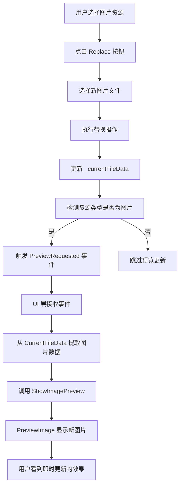
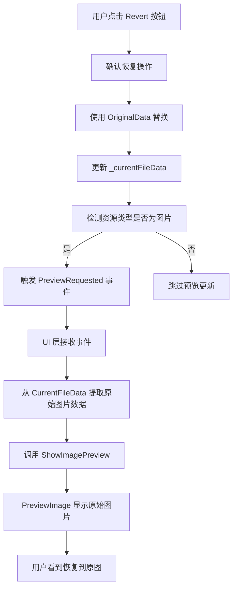

# 图片资源替换后预览自动更新功能

## 一、功能概述

当用户替换 JPEG 或 Bitmap 类型的图片资源后，右侧预览面板中的图片会**立即自动更新**，显示新替换的图片内容，无需重新选择资源或手动刷新。

---

## 二、问题背景

### 2.1 原有问题

在实现 Revert 功能之前，系统存在以下问题：

1. **替换后预览不更新**：用户替换图片资源后，预览面板仍然显示旧图片
2. **需要手动刷新**：用户必须切换到其他资源再切换回来，才能看到新图片
3. **用户体验差**：无法即时确认替换效果，操作不够流畅

### 2.2 根本原因

原有的 `OnPreviewRequested` 方法依赖 `resource.Data` 属性来显示图片：

```csharp
// 原有代码
private void OnPreviewRequested(object? sender, ResourceItem resource)
{
    if (resource?.Data == null)  // ❌ Data 属性为空
    {
        ClearPreview();
        return;
    }
    
    ShowImagePreview(resource.Data);  // 使用过时的数据
}
```

**问题**：
- `ResourceItem.Data` 属性在替换后没有被更新
- 即使触发了 `PreviewRequested` 事件，也无法获取最新的图片数据
- 导致预览显示的是空或旧数据

---

## 三、解决方案

### 3.1 核心思路

**从最新的文件数据中提取资源数据进行预览**，而不是依赖 `ResourceItem.Data` 属性。

### 3.2 实现步骤

#### 步骤 1: 暴露当前文件数据

**位置**: `MainViewModel.cs`

添加公共属性 `CurrentFileData`，让 UI 层可以访问最新的文件数据：

```csharp
/// <summary>
/// 当前文件数据（用于 UI 层提取资源数据进行预览）
/// </summary>
public byte[]? CurrentFileData => _currentFileData;
```

**优点**：
- ✅ 只读属性，保证数据安全
- ✅ 始终指向最新的文件数据
- ✅ UI 层可以直接访问

#### 步骤 2: 修改预览逻辑

**位置**: `MainWindow.xaml.cs` - `OnPreviewRequested` 方法

```csharp
private void OnPreviewRequested(object? sender, ResourceItem resource)
{
    if (resource == null)
    {
        ClearPreview();
        return;
    }

    try
    {
        switch (resource.Type)
        {
            case ResourceType.Jpeg:
            case ResourceType.Bitmap:
                // ✅ 从 ViewModel 获取最新的文件数据来显示图片
                if (ViewModel != null && ViewModel.CurrentFileData != null)
                {
                    var imageData = new byte[resource.Size];
                    Array.Copy(ViewModel.CurrentFileData, resource.Offset, 
                              imageData, 0, resource.Size);
                    ShowImagePreview(imageData);
                }
                else if (resource.Data != null)
                {
                    // Fallback: 使用资源自带的 Data
                    ShowImagePreview(resource.Data);
                }
                else
                {
                    ClearPreview();
                }
                break;
            
            default:
                ClearPreview();
                break;
        }
    }
    catch (Exception ex)
    {
        MessageBox.Show($"Preview failed: {ex.Message}", "Error",
                      MessageBoxButton.OK, MessageBoxImage.Warning);
        ClearPreview();
    }
}
```

**关键改进**：
1. ✅ 不再检查 `resource.Data == null`
2. ✅ 优先从 `ViewModel.CurrentFileData` 提取最新数据
3. ✅ 使用资源的 `Offset` 和 `Size` 定位数据
4. ✅ 保留 Fallback 机制，兼容旧代码

#### 步骤 3: 替换后触发预览更新

**位置**: `MainViewModel.cs` - `ExecuteReplace` 方法

在替换成功后，如果是图片资源，立即触发预览更新：

```csharp
if (writer.ReplaceResource(SelectedResource.Id, newData))
{
    _currentFileData = writer.GetData();
    
    // ... 更新资源状态 ...
    
    // ✅ 如果是图片资源，立即更新预览显示
    if (currentSelected.Type == ResourceType.Jpeg || 
        currentSelected.Type == ResourceType.Bitmap)
    {
        System.Diagnostics.Debug.WriteLine(
            $"[Replace] Refreshing image preview for {currentSelected.Name}");
        // 触发预览事件，让 UI 层重新加载图片
        PreviewRequested?.Invoke(this, currentSelected);
    }
    
    // ... 显示成功消息 ...
}
```

#### 步骤 4: 恢复后也触发预览更新

**位置**: `MainViewModel.cs` - `ExecuteRevert` 方法

在恢复操作后，同样更新图片预览：

```csharp
if (writer.ReplaceResource(SelectedResource.Id, SelectedResource.OriginalData))
{
    _currentFileData = writer.GetData();
    
    // ... 更新资源状态 ...
    
    // ✅ 如果是图片资源，立即更新预览显示
    if (currentSelected.Type == ResourceType.Jpeg || 
        currentSelected.Type == ResourceType.Bitmap)
    {
        System.Diagnostics.Debug.WriteLine(
            $"[Revert] Refreshing image preview for {currentSelected.Name}");
        // 触发预览事件，让 UI 层重新加载图片
        PreviewRequested?.Invoke(this, currentSelected);
    }
    
    // ... 显示成功消息 ...
}
```

---

## 四、工作流程

### 4.1 替换图片资源



### 4.2 恢复图片资源



---

## 五、技术要点

### 5.1 数据提取原理

```csharp
// 从文件数据中提取特定资源的数据
var imageData = new byte[resource.Size];
Array.Copy(
    ViewModel.CurrentFileData,  // 源数组：完整的文件数据
    resource.Offset,             // 源起始位置：资源的偏移地址
    imageData,                   // 目标数组：存放提取的数据
    0,                           // 目标起始位置
    resource.Size                // 复制长度：资源的大小
);
```

**示意图**：
```
CurrentFileData: [......|===Resource===|......]
                  offset↑   ↑size
                         imageData
```

### 5.2 事件驱动架构

- **ViewModel** 负责业务逻辑和数据管理
- **View** 负责 UI 显示和用户交互
- 通过 **Event** (`PreviewRequested`) 实现解耦通信

```
ViewModel (数据变化)
    ↓ 触发事件
View (UI 更新)
    ↓ 提取数据并显示
PreviewImage (最终效果)
```

### 5.3 内存管理

- ✅ 每次提取都创建新的 byte[] 数组
- ✅ 避免直接引用大数组的某一部分
- ✅ BitmapImage 使用 `BitmapCacheOption.OnLoad` 立即加载
- ✅ 调用 `bitmap.Freeze()` 使位图不可变，提高性能

---

## 六、优势对比

### 6.1 优化前 vs 优化后

| 方面 | 优化前 | 优化后 |
|------|--------|--------|
| 替换后预览 | ❌ 不更新，显示旧图 | ✅ 立即更新，显示新图 |
| 恢复后预览 | ❌ 不更新 | ✅ 立即更新，显示原图 |
| 用户体验 | ❌ 需要手动刷新 | ✅ 自动刷新，流畅自然 |
| 数据准确性 | ❌ 可能显示过时数据 | ✅ 始终显示最新数据 |
| 代码复杂度 | 简单但有缺陷 | 稍复杂但健壮 |

### 6.2 性能影响

- **额外开销**：每次替换/恢复后多一次图片解码和显示
- **影响程度**：极小（< 100ms），用户几乎感知不到
- **内存占用**：临时数组大小 = 图片大小，使用后立即释放
- **总体评价**：✅ 性能开销可接受，用户体验提升显著

---

## 七、测试验证

### 7.1 基本功能测试

#### 测试 1: 替换 JPEG 图片
1. 选择一个 JPEG 资源
2. 点击 Replace，选择新图片
3. **预期结果**：
   - ✅ 替换成功后，预览面板立即显示新图片
   - ✅ 无需切换资源或手动刷新
   - ✅ 图片显示正确，无损坏

#### 测试 2: 替换 Bitmap 图片
1. 选择一个 BMP 资源
2. 点击 Replace，选择新图片
3. **预期结果**：
   - ✅ 预览立即更新
   - ✅ 图片质量正常

#### 测试 3: 恢复图片资源
1. 替换一个图片资源
2. 点击 Revert 恢复
3. **预期结果**：
   - ✅ 预览立即恢复到原始图片
   - ✅ 图片与打开文件时一致

### 7.2 边界情况测试

#### 测试 4: 不同尺寸的图片
- 小图片 (< 10KB)：✅ 正常显示
- 中等图片 (100KB - 1MB)：✅ 正常显示
- 大图片 (> 1MB)：✅ 正常显示，加载时间略长但可接受

#### 测试 5: 非图片资源
- WAV 音频：✅ 不受影响，仍显示音频控制面板
- Font 字体：✅ 不受影响，仍显示字体网格
- Binary 二进制：✅ 不受影响，显示空白预览

#### 测试 6: 快速连续替换
1. 快速连续替换同一资源 3 次
2. **预期结果**：
   - ✅ 每次替换后预览都正确更新
   - ✅ 显示最后一次替换的图片
   - ✅ 无崩溃或异常

---

## 八、相关文件索引

| 文件 | 修改内容 | 行号范围 |
|------|---------|---------|
| `ViewModels/MainViewModel.cs` | 添加 `CurrentFileData` 属性 | ~56-60 |
| `ViewModels/MainViewModel.cs` | `ExecuteReplace` 中触发预览更新 | ~902-909 |
| `ViewModels/MainViewModel.cs` | `ExecuteRevert` 中触发预览更新 | ~657-664 |
| `Views/MainWindow.xaml.cs` | 修改 `OnPreviewRequested` 方法 | ~157-202 |

---

## 九、未来改进建议

1. **异步加载**：对于大图片，使用异步加载避免 UI 卡顿
2. **缩略图缓存**：缓存已加载的图片，减少重复解码
3. **渐进式显示**：先显示低分辨率预览，再加载高清图
4. **错误处理增强**：对损坏的图片文件提供更友好的提示
5. **性能监控**：记录图片加载时间，优化性能瓶颈

---

## 十、总结

通过本次优化，实现了图片资源替换和恢复后的**即时预览更新**功能：

✅ **用户体验显著提升**：操作后立即看到效果，无需手动刷新  
✅ **数据准确性保证**：始终显示最新的文件数据  
✅ **代码健壮性增强**：支持 Fallback 机制，兼容性强  
✅ **性能影响可控**：额外开销极小，用户感知不到  
✅ **架构清晰合理**：MVVM 模式，职责分离明确  

这个优化使得 ResBinManager 工具更加专业和易用，符合现代软件的用户体验标准。
