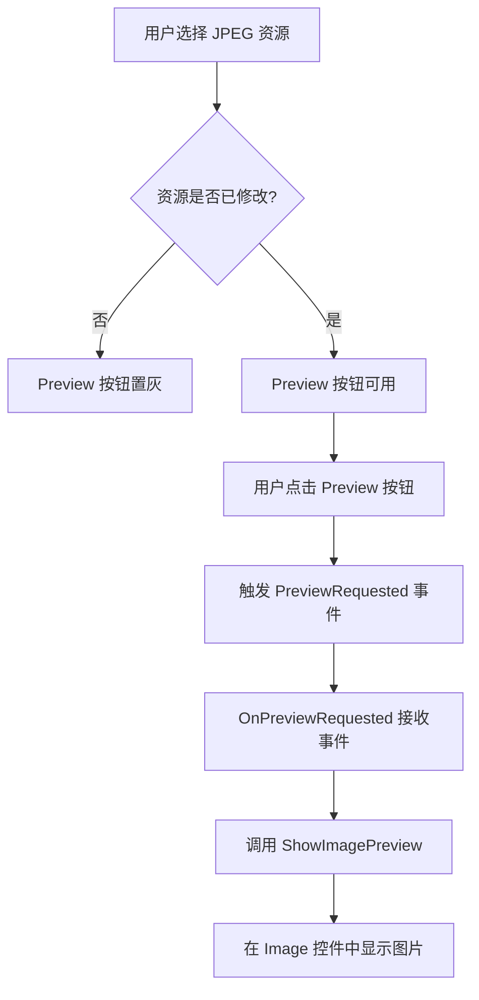
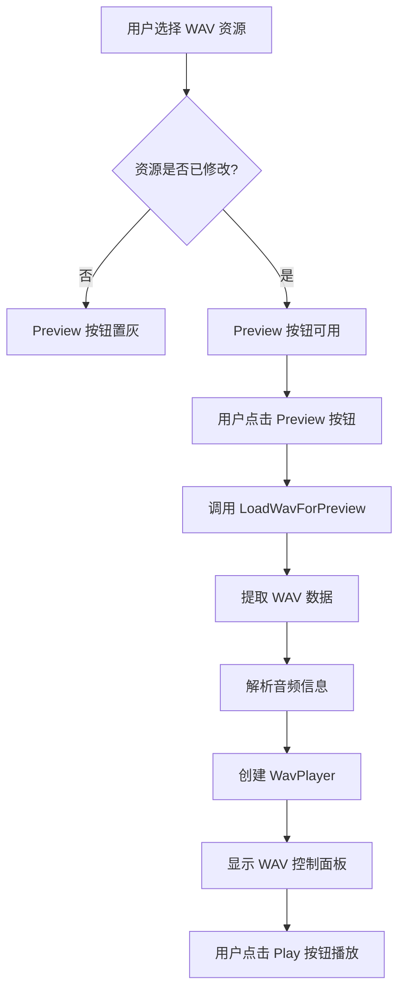
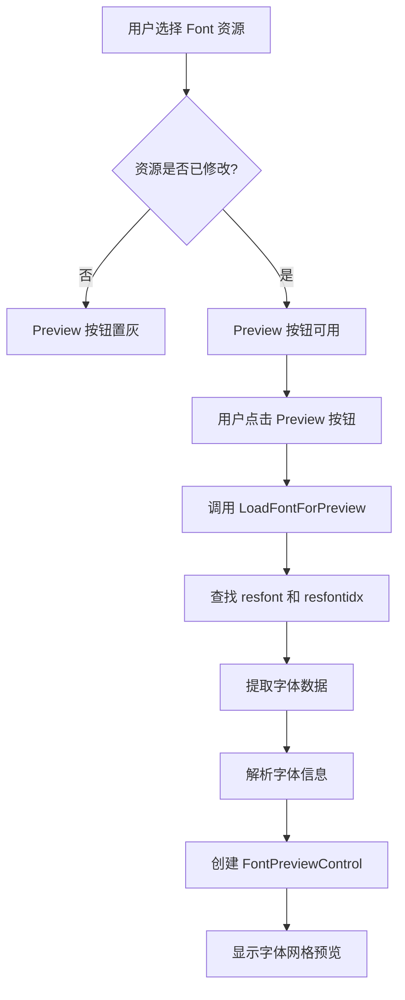

# Preview 按钮功能详细说明

## 一、功能概述

Preview 按钮用于预览当前选中的资源内容。根据资源类型的不同，Preview 按钮会触发不同的预览行为，包括图片显示、音频播放、字体展示等。

**重要约束**：只有当**当前选中的资源被修改后**（`IsModified == true`），Preview 按钮才可用。

---

## 二、核心实现逻辑

### 2.1 按钮可用性控制

**位置**: `ViewModels/MainViewModel.cs` - `CanExecutePreview` 方法

```csharp
private bool CanExecutePreview(object? parameter) 
{ 
    return SelectedResource != null && SelectedResource.IsModified; 
}
```

**条件说明**：
- ✅ 有选中的资源 (`SelectedResource != null`)
- ✅ 该资源已被修改 (`SelectedResource.IsModified == true`)

两个条件必须同时满足，Preview 按钮才会启用。

### 2.2 按钮点击执行流程

**位置**: `ViewModels/MainViewModel.cs` - `ExecutePreview` 方法

```csharp
private void ExecutePreview(object? parameter)
{
    if (SelectedResource == null || _parser == null || _currentFileData == null) return;

    try
    {
        // 检查是否为 WAV 资源
        if (SelectedResource.Type == ResourceType.Wav)
        {
            LoadWavForPreview();
        }
        else
        {
            // 其他类型使用默认预览（图片等）
            StatusMessage = $"Previewing {SelectedResource.Name}...";
            PreviewRequested?.Invoke(this, SelectedResource);
        }
    }
    catch (Exception ex)
    {
        MessageBox.Show($"Preview failed:\n{ex.Message}", 
                      "Error", MessageBoxButton.OK, MessageBoxImage.Error);
    }
}
```

**执行逻辑**：
1. **WAV 资源**：调用 `LoadWavForPreview()` 加载音频信息并准备播放
2. **其他资源**：触发 `PreviewRequested` 事件，由 UI 层处理具体预览逻辑

---

## 三、不同资源类型的预览方式

### 3.1 图片资源 (JPEG / Bitmap)

**触发时机**：选中资源时自动加载，或点击 Preview 按钮

**处理流程**：
1. ViewModel 的 `SelectedResource` setter 触发 `PreviewRequested` 事件
2. MainWindow.xaml.cs 的 `OnPreviewRequested` 方法接收事件
3. 调用 `ShowImagePreview()` 方法显示图片

**代码位置**：
- `MainWindow.xaml.cs` - `ShowImagePreview()` 方法 (第 189-211 行)

```csharp
private void ShowImagePreview(byte[] imageData)
{
    try
    {
        using (var ms = new MemoryStream(imageData))
        {
            var bitmap = new BitmapImage();
            bitmap.BeginInit();
            bitmap.CacheOption = BitmapCacheOption.OnLoad;
            bitmap.StreamSource = ms;
            bitmap.EndInit();
            bitmap.Freeze(); // 使位图可在 UI 线程外访问

            PreviewImage.Source = bitmap;
        }
    }
    catch (Exception ex)
    {
        MessageBox.Show($"Failed to load image: {ex.Message}", "Warning",
                      MessageBoxButton.OK, MessageBoxImage.Warning);
        ClearPreview();
    }
}
```

**UI 显示**：
- 在右侧预览面板的图片区域显示
- `ImagePreviewBorder` 可见
- `ActionButtonsPanel` 可见（包含 Export 和 Replace 按钮）

---

### 3.2 WAV 音频资源

**触发时机**：选中资源时自动加载，或点击 Preview 按钮

**处理流程**：
1. ViewModel 的 `SelectedResource` setter 检测到 WAV 类型
2. 调用 `LoadWavForPreview()` 方法
3. 提取 WAV 数据并解析音频信息
4. 创建 WavPlayer 实例并加载音频数据

**代码位置**：
- `MainViewModel.cs` - `LoadWavForPreview()` 方法 (第 1337-1368 行)

```csharp
private void LoadWavForPreview()
{
    if (SelectedResource == null || _parser == null || _currentFileData == null)
        return;

    try
    {
        // 提取 WAV 数据
        var wavData = new byte[SelectedResource.Size];
        Array.Copy(_currentFileData, SelectedResource.Offset, wavData, 0, SelectedResource.Size);
        
        // 解析 WAV 信息
        WavInfo = WavInfoParser.Parse(wavData);
        
        // 创建播放器
        if (_wavPlayer == null)
        {
            _wavPlayer = new WavPlayer();
            _wavPlayer.PlaybackStateChanged += OnWavPlaybackStateChanged;
        }
        
        _wavPlayer.Load(wavData);
        
        StatusMessage = $"WAV loaded: {WavInfo.FullDescription}";
    }
    catch (Exception ex)
    {
        MessageBox.Show($"Failed to load WAV:\n{ex.Message}", 
                      "Error", MessageBoxButton.OK, MessageBoxImage.Error);
        WavInfo = null;
    }
}
```

**UI 显示**：
- `WavControlPanel` 可见
- 显示音频信息（时长、采样率、声道数、格式）
- 提供播放/停止按钮
- 提供音量控制滑块
- `ImagePreviewBorder` 隐藏

**播放控制**：
- **Play 按钮**：调用 `ExecutePlayWav()` 开始播放
- **Stop 按钮**：调用 `ExecuteStopWav()` 停止播放
- **音量滑块**：实时调整播放音量 (0-100%)

---

### 3.3 字体资源 (Font)

**触发时机**：选中资源时自动加载

**处理流程**：
1. ViewModel 的 `SelectedResource` setter 检测到字体类型
2. 调用 `LoadFontForPreview()` 方法
3. 查找并提取 `resfont` 和 `resfontidx` 两个相关资源
4. 解析字体信息并创建 FontPreviewControl

**代码位置**：
- `MainViewModel.cs` - `LoadFontForPreview()` 方法 (第 1538-1610 行)
- `MainWindow.xaml.cs` - `LoadFontPreview()` 方法 (第 124-155 行)

```csharp
private void LoadFontForPreview()
{
    // ... 省略部分代码 ...
    
    // 提取 resfont 和 resfontidx
    ResourceItem? resfont = null;
    ResourceItem? resfontidx = null;
    
    foreach (var fontRes in fontResources)
    {
        if (fontRes.Name.Contains("resfontidx", StringComparison.OrdinalIgnoreCase))
        {
            resfontidx = fontRes;
        }
        else if (fontRes.Name.Contains("resfont", StringComparison.OrdinalIgnoreCase))
        {
            resfont = fontRes;
        }
    }
    
    // 至少需要一个 resfont
    if (resfont == null)
    {
        StatusMessage = "resfont resource not found";
        return;
    }

    // 提取字体数据
    FontData = new byte[resfont.Size];
    Array.Copy(_currentFileData, resfont.Offset, FontData, 0, resfont.Size);

    FontIndex = new byte[resfontidx.Size];
    Array.Copy(_currentFileData, resfontidx.Offset, FontIndex, 0, resfontidx.Size);

    // 解析字体信息
    FontInfo = FontInfoParser.Parse(FontData, FontIndex);

    StatusMessage = $"Font loaded: {FontInfo.DisplayName}";
}
```

**UI 显示**：
- `FontControlPanel` 可见
- 显示字体名称和字符网格预览
- 提供缩放控制（Zoom In/Out）
- 提供网格线开关
- 提供 "Replace Font" 按钮
- `ImagePreviewBorder` 隐藏
- `ActionButtonsPanel` 隐藏

**字体预览特性**：
- 以网格形式展示所有字符
- 支持缩放查看细节（40% - 300%）
- 可显示/隐藏网格线辅助查看
- 点击字符可查看详细信息

---

### 3.4 二进制资源 (Palette, GameMap, EncodingTable, IconSelection, OsdSource)

**触发时机**：选中资源时自动触发预览事件

**处理流程**：
1. ViewModel 的 `SelectedResource` setter 触发 `PreviewRequested` 事件
2. MainWindow.xaml.cs 的 `OnPreviewRequested` 方法接收事件
3. 由于这些类型没有专门的预览逻辑，调用 `ClearPreview()` 清空预览区

**UI 显示**：
- `ImagePreviewBorder` 可见（但内容为空）
- `ActionButtonsPanel` 可见（提供 Export 和 Replace 按钮）
- 主要依靠属性面板查看资源信息

**说明**：
- 这些资源类型目前不支持可视化预览
- 用户可以通过 Export 功能导出后使用其他工具查看
- 或者通过 Replace 功能替换为新文件

---

### 3.5 其他未知类型资源

**处理方式**：与二进制资源类似，仅显示基本信息，不提供可视化预览。

---

## 四、UI 面板切换逻辑

**位置**: `MainWindow.xaml.cs` - `OnViewModelPropertyChanged` 方法 (第 40-104 行)

当用户选择不同的资源时，系统会根据资源类型自动切换 UI 面板的可见性：

```csharp
private void OnViewModelPropertyChanged(object? sender, PropertyChangedEventArgs e)
{
    if (e.PropertyName == nameof(MainViewModel.SelectedResource))
    {
        var resourceType = ViewModel?.SelectedResource?.Type;
        
        if (resourceType == Models.ResourceType.Wav)
        {
            // WAV 面板
            WavControlPanel.Visibility = Visibility.Visible;
            FontControlPanel.Visibility = Visibility.Collapsed;
            ImagePreviewBorder.Visibility = Visibility.Collapsed;
            ActionButtonsPanel.Visibility = Visibility.Visible;
        }
        else if ((resourceType == Models.ResourceType.Binary || resourceType == Models.ResourceType.Font) 
                 && IsFontResource(ViewModel?.SelectedResource))
        {
            // Font 面板
            WavControlPanel.Visibility = Visibility.Collapsed;
            FontControlPanel.Visibility = Visibility.Visible;
            ImagePreviewBorder.Visibility = Visibility.Collapsed;
            ActionButtonsPanel.Visibility = Visibility.Collapsed;
        }
        else if (resourceType == Models.ResourceType.Jpeg || resourceType == Models.ResourceType.Bitmap)
        {
            // 图片预览
            WavControlPanel.Visibility = Visibility.Collapsed;
            FontControlPanel.Visibility = Visibility.Collapsed;
            ImagePreviewBorder.Visibility = Visibility.Visible;
            ActionButtonsPanel.Visibility = Visibility.Visible;
        }
        // ... 其他类型处理 ...
    }
}
```

---

## 五、状态更新机制

### 5.1 选中资源变化时

**位置**: `MainViewModel.cs` - `SelectedResource` setter (第 104-105 行)

```csharp
// 通知命令状态更新，使 Preview 按钮根据选中资源的 IsModified 状态变化
(PreviewCommand as RelayCommand)?.RaiseCanExecuteChanged();
```

**作用**：
- 当用户切换到未修改的资源时，Preview 按钮自动置灰
- 当用户切换到已修改的资源时，Preview 按钮自动启用

### 5.2 资源替换后

**位置**: 
- `ExecuteReplace` 方法 (第 771-773 行)
- `ExecuteReplaceFont` 方法 (第 1988-1990 行)

```csharp
// 标记资源为已修改
currentSelected.IsModified = true;

// 通知 Preview 命令状态更新
(PreviewCommand as RelayCommand)?.RaiseCanExecuteChanged();
```

**作用**：
- 替换操作完成后，立即启用 Preview 按钮
- 确保用户可以预览刚替换的资源

---

## 六、完整工作流程示例

### 场景 1: 预览图片资源



### 场景 2: 预览 WAV 音频



### 场景 3: 预览字体资源



---

## 七、技术要点总结

### 7.1 MVVM 模式应用

- **ViewModel** 负责业务逻辑和数据状态管理
- **View** 负责 UI 显示和用户交互
- 通过 **Command** 和 **Event** 实现解耦

### 7.2 命令模式

- `PreviewCommand` 封装了预览操作的逻辑
- `CanExecutePreview` 控制按钮可用性
- `RaiseCanExecuteChanged` 手动触发状态更新

### 7.3 事件驱动

- `PreviewRequested` 事件实现 ViewModel 到 View 的通知
- 不同类型资源通过事件参数传递数据

### 7.4 状态管理

- `IsModified` 标志跟踪资源修改状态
- `SelectedResource` 变化时自动更新 UI
- 确保按钮状态与数据状态同步

---

## 八、注意事项

1. **Preview 按钮不是必需的**：对于图片和字体资源，选中时会自动加载预览，无需点击 Preview 按钮
2. **WAV 资源特殊**：需要点击 Preview 按钮或 Play 按钮才能播放音频
3. **二进制资源**：目前不支持可视化预览，建议导出后使用专业工具查看
4. **状态同步**：保存文件后，所有资源的 `IsModified` 会被重置，Preview 按钮会再次置灰

---

## 九、相关文件索引

| 文件 | 关键方法/属性 | 行号范围 |
|------|--------------|---------|
| `MainViewModel.cs` | `CanExecutePreview` | 1301-1307 |
| `MainViewModel.cs` | `ExecutePreview` | 1309-1333 |
| `MainViewModel.cs` | `LoadWavForPreview` | 1337-1368 |
| `MainViewModel.cs` | `LoadFontForPreview` | 1538-1610 |
| `MainViewModel.cs` | `SelectedResource` setter | 63-107 |
| `MainWindow.xaml.cs` | `OnPreviewRequested` | 157-187 |
| `MainWindow.xaml.cs` | `ShowImagePreview` | 189-211 |
| `MainWindow.xaml.cs` | `LoadFontPreview` | 124-155 |
| `MainWindow.xaml.cs` | `OnViewModelPropertyChanged` | 40-104 |
