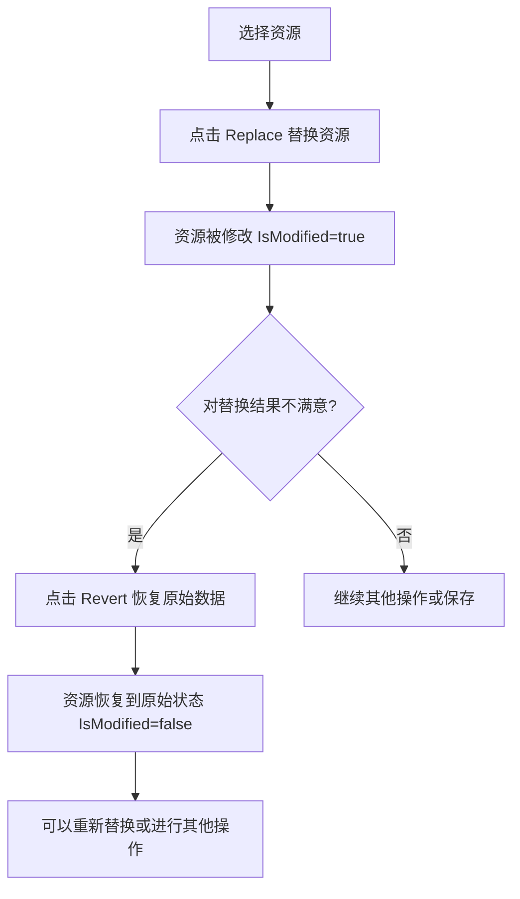

# 资源恢复（Revert）功能说明

## 一、功能概述

**Revert（恢复）** 功能允许用户将已被替换的资源恢复到替换前的原始状态。这是一个"撤销"操作，可以取消之前的替换操作。

---

## 二、使用场景

### 2.1 典型工作流程



### 2.2 应用场景

1. **替换后发现效果不好**：替换图片后显示效果不理想，想恢复原图
2. **误操作**：不小心替换了错误的资源
3. **对比测试**：想对比替换前后的效果
4. **临时回退**：在保存前想回到原始状态重新考虑

---

## 三、实现原理

### 3.1 数据保存机制

**位置**: `MainViewModel.cs` - `ExecuteReplace` 方法

在首次替换资源时，系统会自动保存原始数据：

```csharp
// 如果是第一次修改，先保存原始数据用于恢复
if (!SelectedResource.IsModified)
{
    SelectedResource.OriginalData = new byte[SelectedResource.Size];
    Array.Copy(_currentFileData!, SelectedResource.Offset, 
              SelectedResource.OriginalData, 0, SelectedResource.Size);
    SelectedResource.OriginalSize = SelectedResource.Size;
    System.Diagnostics.Debug.WriteLine($"[Revert] Saved original data for {SelectedResource.Name}, Size={SelectedResource.OriginalSize}");
}
```

**关键点**：
- ✅ 只在**第一次修改**时保存原始数据
- ✅ 保存完整的原始字节数据
- ✅ 记录原始大小
- ✅ 多次替换不会覆盖已保存的原始数据

### 3.2 ResourceItem 模型扩展

**位置**: `Models/ResourceItem.cs`

添加了两个新属性来支持恢复功能：

```csharp
/// <summary>
/// 替换前的原始数据（用于恢复）
/// </summary>
public byte[]? OriginalData
{
    get => _originalData;
    set { _originalData = value; }
}

/// <summary>
/// 替换前的原始大小
/// </summary>
public uint OriginalSize
{
    get => _originalSize;
    set { _originalSize = value; }
}
```

### 3.3 恢复执行逻辑

**位置**: `MainViewModel.cs` - `ExecuteRevert` 方法

```csharp
private void ExecuteRevert(object? parameter)
{
    if (SelectedResource == null || _parser == null || SelectedResource.OriginalData == null)
        return;

    // 确认对话框
    var result = MessageBox.Show(
        $"Are you sure you want to revert '{SelectedResource.Name}' to its original state?\n\n" +
        $"This will undo the replacement and restore the original data.",
        "Confirm Revert",
        MessageBoxButton.YesNo,
        MessageBoxImage.Question);

    if (result != MessageBoxResult.Yes)
    {
        StatusMessage = "Revert cancelled";
        return;
    }

    StatusMessage = $"Reverting {SelectedResource.Name}...";

    try
    {
        // 使用原始数据替换当前数据
        var writer = new ResBinWriter(_currentFileData!, _currentTableOffset, 
                                    _parser.GetResourceTable());
        
        if (writer.ReplaceResource(SelectedResource.Id, SelectedResource.OriginalData))
        {
            _currentFileData = writer.GetData();
            
            // 更新资源状态
            var currentSelected = SelectedResource;
            currentSelected.IsModified = false;
            currentSelected.Size = currentSelected.OriginalSize;
            
            // 清除保存的原始数据
            currentSelected.OriginalData = null;
            currentSelected.OriginalSize = 0;
            
            // 通知 Preview 命令状态更新
            (PreviewCommand as RelayCommand)?.RaiseCanExecuteChanged();
            
            StatusMessage = $"✓ Reverted {currentSelected.Name} to original";
            
            // 刷新列表显示
            // ... UI 更新代码 ...
        }
    }
    catch (Exception ex)
    {
        // 错误处理
    }
}
```

**执行步骤**：
1. 验证是否可以执行恢复（有选中资源、已修改、有原始数据）
2. 显示确认对话框
3. 使用保存的原始数据调用 `ResBinWriter.ReplaceResource`
4. 更新资源状态（`IsModified = false`）
5. 恢复原始大小
6. 清除保存的原始数据（释放内存）
7. 更新 UI 和命令状态

---

## 四、UI 界面

### 4.1 工具栏按钮

**位置**: 主窗口顶部工具栏，Replace 按钮右侧

```
[🔄 Replace] [↩️ Revert] [💾 Export] [💿 Save]
```

**特点**：
- 图标：↩️ （向左箭头，表示回退/撤销）
- 文本：Revert
- 提示：Revert selected resource to original (after replacement)
- 状态：只有在资源被修改且有原始数据时才可用

### 4.2 预览面板按钮

**位置**: 右侧预览面板底部，Export 和 Replace 按钮旁边

```
[Export] [Replace] [Revert]
```

**特点**：
- 橙色背景 (#FF9800)，白色文字，突出显示
- 提示：Revert to original data (only available after replacement)
- 与 Export 和 Replace 按钮并排显示

---

## 五、按钮状态控制

### 5.1 可用性条件

**位置**: `MainViewModel.cs` - `CanExecuteRevert` 方法

```csharp
private bool CanExecuteRevert(object? parameter)
{
    return SelectedResource != null && 
           SelectedResource.IsModified && 
           SelectedResource.OriginalData != null;
}
```

**三个条件必须同时满足**：
1. ✅ 有选中的资源 (`SelectedResource != null`)
2. ✅ 该资源已被修改 (`SelectedResource.IsModified == true`)
3. ✅ 存在保存的原始数据 (`SelectedResource.OriginalData != null`)

### 5.2 状态变化示例

| 场景 | Revert 按钮状态 | 说明 |
|------|----------------|------|
| 刚打开文件，未做任何修改 | ❌ 置灰 | 没有资源被修改 |
| 选中未修改的资源 | ❌ 置灰 | 该资源未被修改 |
| 替换资源后 | ✅ 可用 | 资源已修改且有原始数据 |
| 恢复后 | ❌ 置灰 | IsModified 变为 false，原始数据已清除 |
| 保存文件后 | ❌ 置灰 | 所有资源的 IsModified 重置为 false |
| 切换选中到未修改的资源 | ❌ 置灰 | 新选中的资源未被修改 |

---

## 六、完整工作流程示例

### 场景 1: 替换后恢复

```
1. 用户选择资源 ID=10 (logo.bmp)
   → Revert 按钮：置灰 ❌

2. 用户点击 Replace，选择新图片
   → 系统保存原始数据到 OriginalData
   → 资源标记为 IsModified=true
   → Revert 按钮：可用 ✅

3. 用户查看预览，发现新图片效果不好
   → 用户点击 Revert 按钮
   → 系统显示确认对话框

4. 用户确认恢复
   → 系统使用 OriginalData 替换当前数据
   → IsModified 设置为 false
   → Size 恢复为 OriginalSize
   → OriginalData 清空（释放内存）
   → Revert 按钮：置灰 ❌
   → 资源恢复到原始状态
```

### 场景 2: 多次替换

```
1. 初始状态：资源未修改
   → OriginalData = null

2. 第一次替换：A → B
   → 保存原始数据 A 到 OriginalData
   → 当前数据 = B
   → IsModified = true

3. 第二次替换：B → C
   → OriginalData 仍然是 A（不会被覆盖）
   → 当前数据 = C
   → IsModified = true

4. 点击 Revert
   → 恢复到 A（原始数据）
   → OriginalData 清空
   → IsModified = false
```

**重要**：无论替换多少次，OriginalData 始终保存的是**最原始的、第一次替换前的数据**。

---

## 七、注意事项

### 7.1 内存管理

- ✅ 恢复后立即清除 `OriginalData`，释放内存
- ✅ 只在第一次修改时保存，避免重复占用内存
- ⚠️ 如果有很多大资源被修改，会占用较多内存

### 7.2 数据一致性

- ✅ 恢复操作会正确更新资源大小
- ✅ 恢复后 `IsModified` 标志会被清除
- ✅ 恢复后会触发 UI 刷新和命令状态更新

### 7.3 限制条件

- ❌ 未修改的资源无法恢复（没有原始数据）
- ❌ 保存文件后无法恢复（所有修改状态已清除）
- ❌ 关闭程序后无法恢复（内存中的数据已丢失）

### 7.4 用户体验

- ✅ 恢复前有确认对话框，防止误操作
- ✅ 恢复后有成功提示消息
- ✅ 状态消息实时更新，显示操作进度
- ✅ 按钮状态实时反映当前是否可恢复

---

## 八、技术要点

### 8.1 MVVM 模式应用

- **Model** (ResourceItem): 存储原始数据
- **ViewModel** (MainViewModel): 实现恢复逻辑
- **View** (MainWindow.xaml): 显示恢复按钮

### 8.2 命令模式

- `RevertCommand` 封装恢复操作
- `CanExecuteRevert` 控制按钮可用性
- 自动状态更新机制

### 8.3 数据安全

- 替换前先保存原始数据（保证数据完整性）
- 恢复时使用相同的 `ResBinWriter` 机制（保证格式一致）
- 异常处理和错误提示

---

## 九、相关文件索引

| 文件 | 关键内容 | 行号范围 |
|------|---------|---------|
| `Models/ResourceItem.cs` | OriginalData, OriginalSize 属性 | 新增 |
| `ViewModels/MainViewModel.cs` | RevertCommand 定义 | ~211 |
| `ViewModels/MainViewModel.cs` | CanExecuteRevert 方法 | ~2024-2030 |
| `ViewModels/MainViewModel.cs` | ExecuteRevert 方法 | ~2032-2120 |
| `ViewModels/MainViewModel.cs` | ExecuteReplace 中保存原始数据 | ~670-678 |
| `Views/MainWindow.xaml` | 工具栏 Revert 按钮 | ~44-50 |
| `Views/MainWindow.xaml` | 预览面板 Revert 按钮 | ~206-210 |

---

## 十、未来改进建议

1. **批量恢复**：支持一次性恢复所有已修改的资源
2. **恢复历史**：保存多次替换的历史记录，支持多步撤销
3. **快捷键**：添加 Ctrl+Z 快捷键支持
4. **恢复全部**：添加"恢复所有"按钮，一键恢复所有修改
5. **确认选项**：添加"不再提示"选项，减少频繁确认
