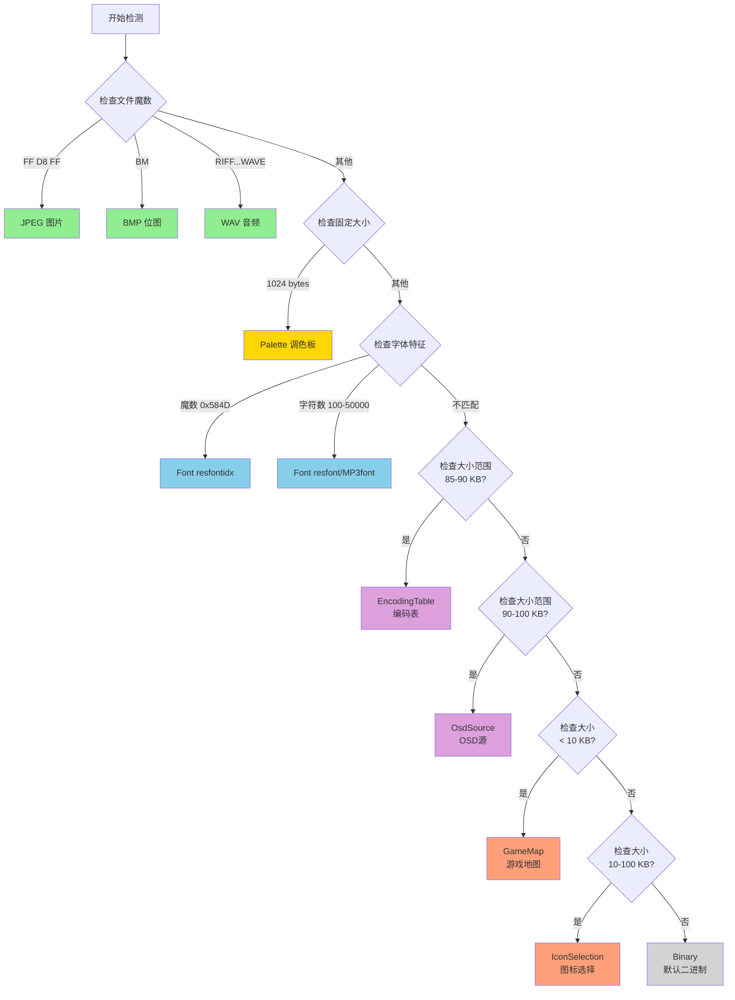

# 资源类型检测决策树

## 检测流程图（Mermaid）



## 检测维度分类

### 📍 维度 1: 文件魔数 (Magic Number)
**可靠性**: ⭐⭐⭐⭐⭐ | **优先级**: 最高

| 魔数 | 类型 | 字节位置 | 示例 |
|------|------|---------|------|
| `FF D8 FF` | JPEG | 0-2 | power_on.jpg |
| `42 4D` ('BM') | Bitmap | 0-1 | gamemenu_maze.bmp |
| `52 49 46 46 ... 57 41 56 45` ('RIFF...WAVE') | WAV | 0-3, 8-11 | music_power_on.wav |
| `58 4D` (0x584D) | Font (idx) | 0-1 | resfontidx.bin |

**特点**: 
- ✅ 100% 准确，无误判
- ✅ 与文件大小无关
- ❌ 仅适用于有标准文件头的格式

---

### 📏 维度 2: 固定大小
**可靠性**: ⭐⭐⭐⭐ | **优先级**: 高

| 大小 | 类型 | 说明 | 示例 |
|------|------|------|------|
| 1024 bytes | Palette | 256色 × 4字节(RGBA) | palette.bin |

**特点**: 
- ✅ 简单高效
- ⚠️ 需确保无其他文件恰好为此大小
- ❌ 扩展性差

---

### 🔍 维度 3: 结构特征
**可靠性**: ⭐⭐⭐⭐ | **优先级**: 中高

#### Font 数据结构检测

**resfont.bin / MP3font.bin**:
```
前4字节 = 字符数量 (uint32, 小端序)
合理范围: 100 - 50,000
```

**验证逻辑**:
```csharp
uint charCount = BitConverter.ToUInt32(data, 0);
if (charCount >= 100 && charCount <= 50000)
    return true;  // 是字体文件
```

**实际案例**:
- resfont.bin: 899 chars ✓
- MP3font.bin: 20,998 chars ✓

**特点**: 
- ✅ 能识别不同大小的同类文件
- ✅ 基于数据语义，更智能
- ⚠️ 需要知道合理的数值范围
- ⚠️ 可能误判其他含计数字段的文件

---

### 📊 维度 4: 大小范围
**可靠性**: ⭐⭐-⭐⭐⭐ | **优先级**: 中低

| 大小范围 | 类型 | 典型文件 | 可靠性 |
|---------|------|---------|--------|
| 85,000 - 90,000 | EncodingTable | oem2uni936.bin (87,172) | ⭐⭐⭐ |
| 90,000 - 100,000 | OsdSource | OSD_source.bin (93,892) | ⭐⭐⭐ |
| < 10,000 | GameMap | game_block_map.bin (432) | ⭐⭐ |
| 10,000 - 100,000 | IconSelection | mainmenu_sel.bin (69,312) | ⭐⭐ |

**特点**: 
- ⚠️ 依赖项目特定的文件大小
- ⚠️ 不同项目可能有差异
- ⚠️ 容易误判相似大小的其他文件
- ❌ 缺乏内容验证

---

## 检测顺序原理

### 为什么是这个顺序？

```
1. 魔数检测 (最特异)
   ↓
2. 固定大小 (唯一值)
   ↓
3. 结构特征 (语义分析)
   ↓
4. 大小范围 (宽泛区间)
   ↓
5. 默认类型 (兜底)
```

### 设计原则

1. **特异性递减**: 从最具体的特征到最宽泛的特征
2. **唯一性优先**: 唯一标识（如魔数）优先于范围标识
3. **安全性**: 高可靠性的检测先执行，避免误判
4. **效率**: 快速排除常见类型，减少后续检测开销

### 如果改变顺序会怎样？

❌ **错误示例 1**: GameMap (<10KB) 放在最前面
```
结果: 所有小于10KB的文件都被归类为 GameMap
影响: str_version.bin (12 bytes) → 错误归类
```

❌ **错误示例 2**: Binary 放在最前面
```
结果: 所有资源都被归类为 Binary
影响: 完全失效
```

❌ **错误示例 3**: 大小范围在魔数之前
```
结果: JPEG/BMP/WAV 可能被误判为其他类型
影响: 标准格式无法识别
```

✅ **正确顺序**: 当前实现
```
结果: 高特异性检测优先，逐步细化分类
影响: 最大化准确性，最小化误判
```

---

## 各类型检测路径示例

### 示例 1: power_on.jpg (40.5 KB)

```
输入: data[0..2] = FF D8 FF
  ↓
检查魔数: FF D8 FF ✓
  ↓
输出: ResourceType.Jpeg
```

**路径长度**: 1 步  
**检测依据**: 魔数  
**可靠性**: 100%

---

### 示例 2: palette.bin (1 KB)

```
输入: length = 1024
  ↓
检查魔数: 不匹配
  ↓
检查固定大小: 1024 ✓
  ↓
输出: ResourceType.Palette
```

**路径长度**: 2 步  
**检测依据**: 固定大小  
**可靠性**: 95%

---

### 示例 3: MP3font.bin (982.8 KB)

```
输入: data[0..3] = 06 52 00 00 (charCount = 20,998)
  ↓
检查魔数: 不匹配
  ↓
检查固定大小: 不是 1024
  ↓
检查字体特征: 
  - 检查魔数 0x584D: 不匹配
  - 检查字符数量: 20,998 ∈ [100, 50000] ✓
  ↓
输出: ResourceType.Font
```

**路径长度**: 3 步  
**检测依据**: 结构特征（字符数量）  
**可靠性**: 90%

---

### 示例 4: game_block_map.bin (432 bytes)

```
输入: length = 432
  ↓
检查魔数: 不匹配
  ↓
检查固定大小: 不是 1024
  ↓
检查字体特征: 
  - 魔数 0x584D: 不匹配
  - 字符数量: 不在 [100, 50000] 范围
  ↓
检查大小范围:
  - 85-90 KB: 否
  - 90-100 KB: 否
  - < 10 KB: 432 < 10000 ✓
  ↓
输出: ResourceType.GameMap
```

**路径长度**: 5 步  
**检测依据**: 大小范围  
**可靠性**: 70%

---

### 示例 5: str_version.bin (12 bytes)

```
输入: length = 12
  ↓
检查魔数: 不匹配
  ↓
检查固定大小: 不是 1024
  ↓
检查字体特征: 不匹配
  ↓
检查大小范围:
  - 85-90 KB: 否
  - 90-100 KB: 否
  - < 10 KB: 12 < 10000 ✓
  ↓
输出: ResourceType.GameMap  ⚠️ (可能误判)
```

**路径长度**: 5 步  
**检测依据**: 大小范围  
**可靠性**: 50% (可能是 Binary)

**问题**: str_version.bin 被误判为 GameMap，因为它是小文件但并非游戏地图。

**改进建议**: 
- 添加文件名辅助判断
- 或调整 GameMap 的大小下限

---

## 优化建议总结

### 短期优化（易实施）

1. **添加文件名辅助**
   ```csharp
   string name = GetResourceName(resourceId);
   if (name.Contains("_map") && length < 10000)
       return ResourceType.GameMap;
   ```

2. **增加验证器集成**
   ```csharp
   if (type == ResourceType.GameMap && !IsValidGameMap(data))
       type = ResourceType.Binary;
   ```

3. **调整大小阈值**
   ```csharp
   // GameMap: < 5 KB (更严格)
   if (length < 5000)
       return ResourceType.GameMap;
   ```

### 长期优化（需重构）

1. **引入机器学习分类**
   - 训练模型识别不同资源类型的字节分布特征
   - 提高非魔数类型的准确性

2. **建立资源指纹库**
   - 为每种类型维护多个样本的特征向量
   - 通过相似度匹配进行分类

3. **支持插件式检测器**
   - 允许用户自定义检测规则
   - 适应不同项目的特殊需求

---

## 结论

当前的资源类型检测系统采用**多层次、多维度**的检测策略，在大多数情况下能够准确识别资源类型。核心优势在于：

✅ 对标准格式（JPEG/BMP/WAV）100% 准确  
✅ 对字体文件支持多种格式和大小  
✅ 检测顺序经过精心设计，最大化准确性  

主要局限在于部分类型仅依赖大小范围，存在误判风险。建议通过添加内容验证和文件名辅助来进一步提升准确性。
